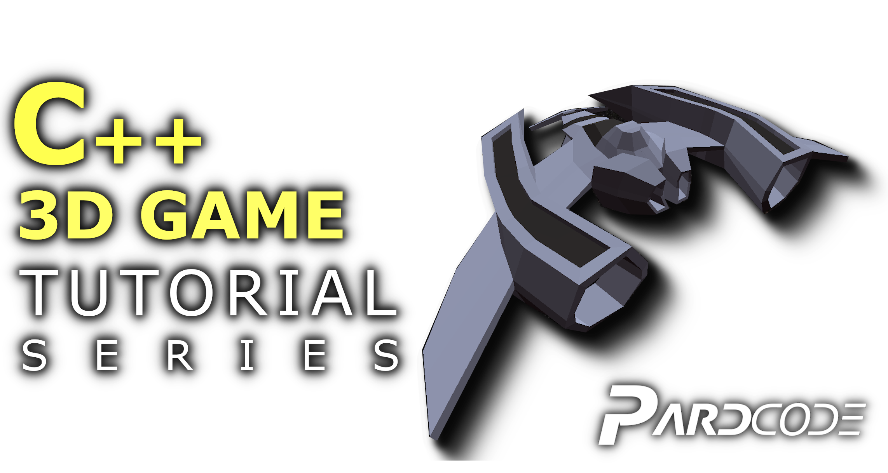

**C++ 3D Game Tutorial Series** is a
YouTube tutorial series, whose purpose is to help all those who want to take their first steps in
the game development from scratch.
In this series will be developed a 3D Game Demo, starting from the creation of a Window by using Win32 API ,
going through the making of a 3D Graphics Engine,
and all the necessary sub-systems in order to achieve a complete 3D Game,
like the Audio System, GUI System, Script System, Entity Component System, Input System and so on.

**License**

The license of this project is based on the modified MIT-License.
That means you can do whatever you want with the code available in this repository. 
The only conditions to meet are:

- include the license text in your product (e.g. in the About Window of a GUI program, or Credits Section of a 2D/3D Visual Game)
- include the license text in all the source code files you get from this repository (copy-paste the license text to the top of all the source code files you get from this repository, even if you have partially modified them)

If you want to modify and/or redistribute the source code files available in this repository, you can optionally add your own copyright notice together with the license text in this way:

...
C++ 3D Game Tutorial Series (https://github.com/PardCode/CPP-3D-Game-Tutorial-Series)
<project name>, <website link or nothing>
  
Copyright (c) 2019-2020, PardCode
Copyright (c) <your years>, <your name>
...

The license text is available in the LICENSE file.
